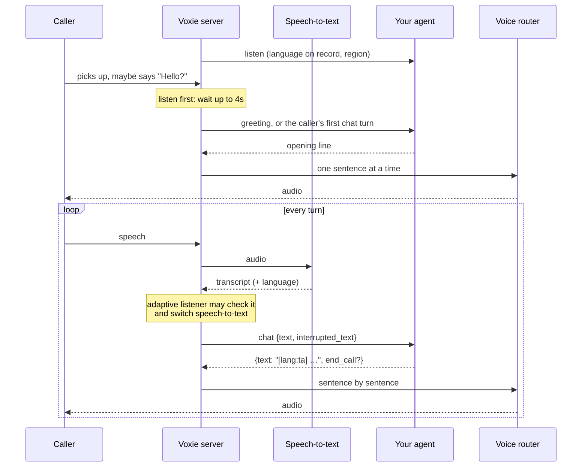

# How a Voxie call works

## The pieces

| Piece | Job |
|---|---|
| **Voxie server** (this repo, Go, `:8080`) | Audio over WebRTC/WHIP, speech detection, turn-taking, barge-in, echo guard, **hearing** (speech-to-text) |
| **Your agent** (your app, HTTP) | **Deciding what to say**: see [agent-contract.md](agent-contract.md) |
| **Voice router** (`voice-router/`, Python, `:8300`) | **Speaking**: Kokoro on the GPU for world languages, Sarvam for Indian languages |
| Phone calls (optional) | Built in for Twilio (`/twilio/media`, Twilio Media Streams: see the README). Any SIP trunk through [sip-server](https://github.com/streamcoreai/sip-server), which turns calls into WHIP sessions |

**Cloud APIs:**
- Deepgram, Sarvam and AssemblyAI for hearing.
- Groq Whisper and Sarvam for identifying the caller's language.
- Sarvam for Indian voices.

## One call



1. **Listen first.** The greeting is held for up to 4s
   (`greeting_delay_ms`). If the caller speaks, the agent answers them
   instead of talking over them.
2. **Hear.** Finals within 350ms are merged into one turn, then Voxie waits
   for 600ms of quiet before the agent replies.
3. **Barge-in.** When the caller talks over the agent, its volume dips at
   once.
   - A real interruption stops it, and the next request says what the
     caller heard (`interrupted_text`).
   - "Yeah, okay", "vale", "d'accord" or "haan" don't stop it.
4. **Speak.** Replies go to the voice one sentence at a time, so the
   agent starts talking before the whole reply is voiced. `।`, `॥`, `。`,
   `！` and `？` end sentences too. A long first sentence goes clause first
   (at a comma or dash), so a slow voice starts sooner: Sarvam's first
   audio went from 1.6–1.9s to 0.7–1.1s.
5. **End.** `end_call: true` hangs up after that line has fully played.

## Choosing the listener: the adaptive listener

No single speech-to-text hears everyone:

| Caller speaks | Deepgram multi | Deepgram, language fixed | Sarvam |
|---|---|---|---|
| English, Hindi, Hinglish | ✅ 0.99+ | – | ✅ |
| Tamil, Telugu, Bengali, Gujarati, Punjabi, Kannada, Marathi | ❌ Hindi-looking nonsense, labelled "hi", 0.70–0.95 | ✅ 0.97–1.00 | ✅ |
| Malayalam | ❌ | ❌ not offered | ✅ |
| Spanish, French, German, Italian, Portuguese, Dutch, Russian, Japanese | ✅ 1.00 | – | ❌ labelled "en-IN", often turned into English |
| Chinese, Korean, Arabic, Turkish | ❌ nothing, or 0.5–0.7 | ✅ 0.98–1.00 | ❌ |

So the hard part is knowing the language, not hearing it.
`[stt] provider = "adaptive"` (`internal/stt/adaptive.go`) handles that
per call:

1. **Start from what the agent knows** (`listen`).
   - A regional Indian language on record → Sarvam.
   - zh, ko, ar or tr → Deepgram fixed to it.
   - Anything else → Deepgram multi. It hears most callers, and streams
     partial words for the best barge-in.
2. **Check turns it may have misheard.** Such a turn is held while its
   audio is identified:
   - Deepgram "hi" below 0.97
   - anything below 0.85
   - speech that produced no transcript at all
   - on Indian numbers, Hindi turns until two checks agree. A confident
     one (0.97+) isn't held: it goes to the agent at once, and the check
     runs in the background, moving the listener for the next turns if
     needed (Punjabi comes back as Hindi at 1.00).
   - speech that produced neither words nor a final

   Turns under about 0.8s of voice ("haan", "ok") are never checked.
3. **Identify.**
   - **Groq Whisper large-v3 names the language:** 24/24 on test clips.
   - **Sarvam runs alongside on Indian calls** and wins whenever it names
     an Indian language, because Whisper slipped on short Bengali,
     Gujarati and Punjabi turns.
   - **Sarvam's "en" is never trusted.** It gives that label to every
     world language.
4. **Switch.** If another listener hears that language:
   - That turn's text is replaced by the identifier's transcript
     (Sarvam's for Indian languages).
   - The call moves to that listener.
   - What the caller said during the check is replayed to it.
5. **Never worse than before.** A failed or slow identification (3s
   cap, 6 checks per call) releases the turn unchanged. Partials are
   never held, so barge-in doesn't wait.

## When something fails

| Layer | Primary | Then | Last resort |
|---|---|---|---|
| Hearing | The call's listener: a failover chain (`world` / `indian`) | The next provider, on a dial failure, a dropped connection, or no transcript 10s after the caller spoke. It wraps round to retry the first | The call loses its hearing only if every provider is down |
| Identifying the language | Groq Whisper | Sarvam | The turn is kept as heard; no switch |
| Voice | Sarvam (Indian) / Kokoro | Kokoro's Hindi voice for hi and mr. After 2 Sarvam failures, a breaker stops calling Sarvam for 60s | `/health` drops what can't be voiced, so the agent can answer in English |

## Turn-taking details

- **Partials vs finals only.** Deepgram and AssemblyAI stream partial
  words, so barge-in checks the words. Sarvam sends finished sentences
  only, so barge-in works on sound: 300ms before the agent's voice dips,
  600ms more before it stops.
  - Barge-in asks on every decision which kind is serving now, so a
    mid-call switch changes it at once.
- **Echo guard.** `echo_guard = "always"` stops the agent's own voice,
  leaking back through a speaker, from counting as the caller. Without
  it, the agent kept dipping mid-sentence, which a user heard as "the
  voice hangs".

## Configuration

Everything lives in [`configs/voxie.toml`](../../configs/voxie.toml).
Keys come from the environment ([`.env.example`](../../.env.example)).
The full list of server settings is in
[`config.toml.example`](../../config.toml.example) and
[`docs/configuration.md`](../configuration.md).

```toml
[stt]
provider = "adaptive"

[stt.adaptive]
world = ["deepgram", "assemblyai", "sarvam"]   # default listener (failover chain)
indian = ["sarvam", "deepgram"]                # after a regional Indian language is identified
identify = ["groq", "sarvam"]
hindi_confidence = 0.97                        # a Deepgram "hi" turn below this is checked
min_confidence = 0.85                          # any Deepgram turn below this is checked
identify_model = "whisper-large-v3"            # the turbo model mislabels Indian languages
```

`provider = "failover"` with `failover = [...]` keeps one fixed order for
every call, if you prefer that.
